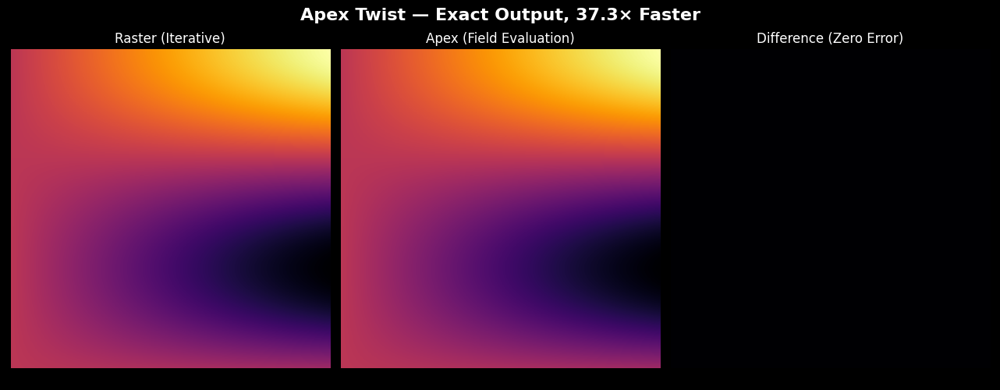
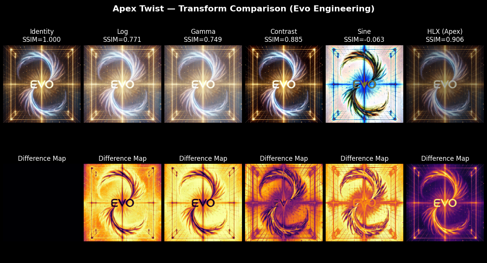
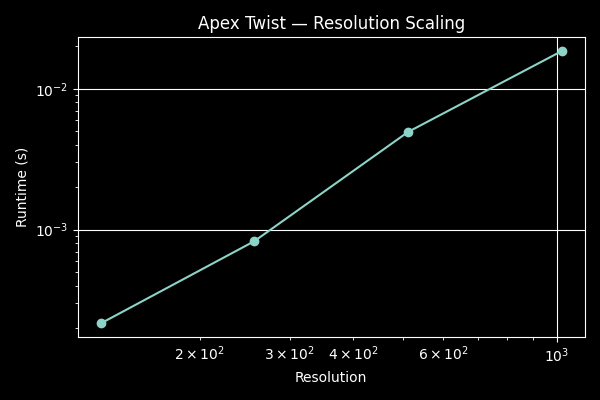

# Apex Twist

Part of **Evo Engineering**  
https://www.evo.engineering/

Exact field-based rendering replacing iterative raster computation.
Produces identical output with significantly reduced compute cost (~35x–70x faster depending on environment).

---

## ⚡ Core Result

- Exact Output
- MSE = 0
- SSIM = 1
- ~35×–70× faster (environment dependent)

---

## 🔥 Demo 1 — Exact + Fast

Raster loop vs direct field evaluation.

Run:
python demos/demo_compare.py

---

## 🧠 Demo 2 — Transform Comparison

Compared against standard image transforms.

Run:
python demos/demo_transforms.py

---

## 📈 Demo 3 — Scaling

Performance across resolution.

Run:
python demos/demo_scaling.py

---

## 🧩 What This Does

Apex Twist evaluates a mathematical field directly instead of computing values iteratively.

In tested cases:

- Produces identical output
- Removes unnecessary computation
- Scales predictably

---

## 📁 Structure

apex-twist/
├── apex/
│   └── core.py
├── demos/
│   ├── demo_compare.py
│   ├── demo_transforms.py
│   ├── demo_scaling.py
├── images/
│   ├── demo_1.png
│   ├── demo_2.png
│   ├── demo_3.png
│   └── evo_logo.jpg

---

## ⚙️ Setup

pip install numpy matplotlib scikit-image pillow

---

## ▶️ Run

python demos/demo_compare.py

---

## By

Evo Engineering Limited Co.
